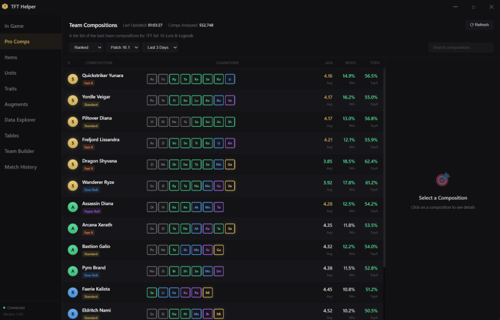

# ⚔️ TFT Helper

### A MetaTFT-style companion app for Teamfight Tactics

---

## ✨ Features

| Feature | Description |
|---------|-------------|
| 🎮 **15+ Meta Compositions** | Real-time compositions from MetaTFT |
| 📊 **Live Statistics** | Average placement, win rate, top 4 rate |
| 🎯 **Positioning Guide** | Visual hex grid for optimal unit placement |
| 🔍 **Smart Search** | Filter by comp name, tier, or champion |
| 🌙 **Premium Dark Theme** | MetaTFT-inspired professional design |
| ⚡ **Lightweight** | Fast and responsive desktop app |

---

## 🖥️ Screenshots

---

## 🚀 Quick Start

### Prerequisites
- [Node.js](https://nodejs.org/) (v18+)
- [Git](https://git-scm.com/)

---

## 🛠️ Tech Stack

| Technology | Purpose |
|------------|---------|
|  | Desktop Framework |
|  | Structure |
|  | Styling |
|  | Logic |

---

## 📋 Composition Tiers

| Tier | Description | Example |
|------|-------------|---------|
| 🏆 **S** | Meta-defining, top performers | Quickstriker Yunara, Yordle Veigar |
| 🥈 **A** | Strong, consistent results | Assassin Diana, Arcana Xerath |
| 🥉 **B** | Situational, needs specific items | Faerie Kalista, Hunter Kog'Maw |
| ⚪ **C** | Risky, requires highroll | Sugarcraft Jinx, Preserver Karma |

---

## 📄 License

This project is licensed under the **Apache 2.0 License** - see the [LICENSE](LICENSE) file for details.

---

### ⚠️ Disclaimer

*This project is not affiliated with or endorsed by Riot Games.*

---

**Designed & Developed by [SpartaKoli](https://github.com/Konalexon) with ❤️**

