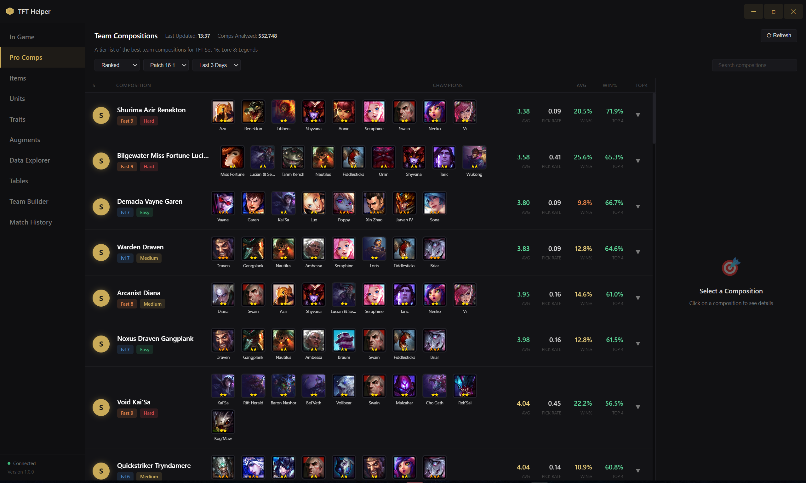
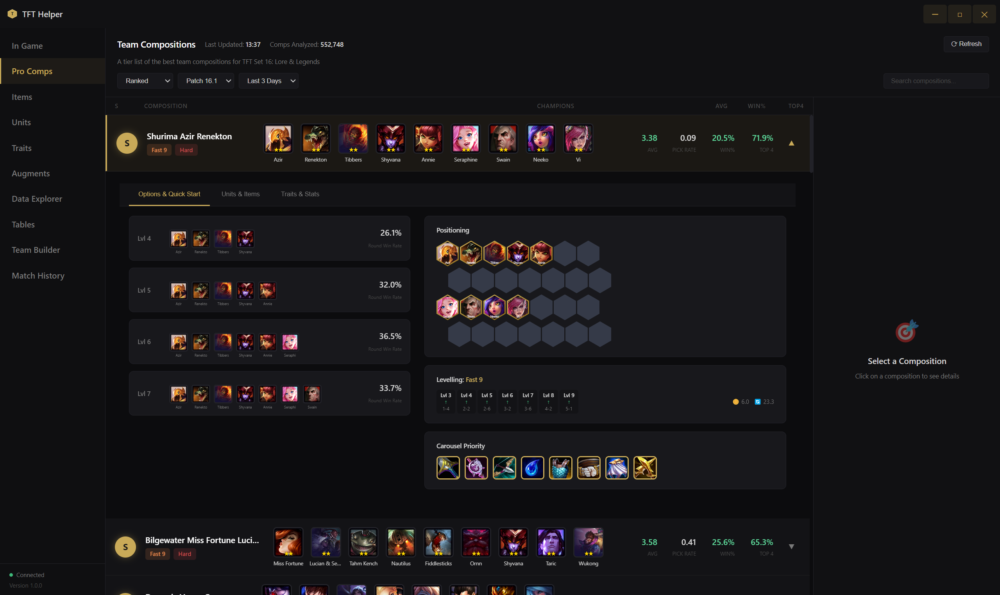

<div align="center">

# ⚔️ TFT Helper

### A companion app for Teamfight Tactics

[](https://www.electronjs.org/)
[](https://developer.mozilla.org/en-US/docs/Web/JavaScript)
[](LICENSE)
[](https://teamfighttactics.leagueoflegends.com/)

</div>

---

## ✨ Features

| Feature | Description |
|---------|-------------|
| 🎮 **15+ Meta Compositions** | Current meta team compositions |
| 📊 **Live Statistics** | Average placement, win rate, top 4 rate |
| 🎯 **Hex Positioning Guide** | Visual hex grid with golden borders for units |
| 📈 **Stage Progression** | Lvl 4-7 board states with win rates |
| ⬆️ **Levelling Guide** | Fast 9, Standard, Slow roll strategies |
| 🎠 **Carousel Priority** | Item recommendations for carousel rounds |
| 🔍 **Smart Search** | Filter by comp name, tier, or champion |
| 🌙 **Premium Dark Theme** | Professional dark design |
| ⚡ **Custom Titlebar** | Frameless window with TFT-styled controls |

---

## 🖥️ Screenshots

<div align="center">

### Main Composition List


### Composition Details


</div>

---

## 🛠️ Tech Stack

<div align="center">

| Technology | Purpose |
|------------|---------|
|  | Desktop Framework |
|  | Structure |
|  | Styling |
|  | Logic |

</div>

---

## 📁 Project Structure

```
electron/
├── main.js              # Electron main process
├── preload.js           # Context bridge for IPC
├── package.json         # Dependencies
├── icons/               # App icons
└── renderer/
    ├── index.html       # Main HTML
    ├── app.js           # Application logic
    ├── styles.css       # TFT-themed styling
    └── assets/
        └── champions/   # Local champion images
```

---

## 📋 Composition Tiers

| Tier | Description | Example |
|------|-------------|---------|
| 🏆 **S** | Meta-defining, top performers | Shurima Azir Renekton, Yordle Veigar |
| 🥈 **A** | Strong, consistent results | Assassin Diana, Arcana Xerath |
| 🥉 **B** | Situational, needs specific items | Faerie Kalista, Hunter Kog'Maw |
| ⚪ **C** | Risky, requires highroll | Sugarcraft Jinx, Preserver Karma |

---

## 🎨 UI Features

### Professional Design
- **Dark theme** with gold accents (#c9aa58)
- **Hexagonal positioning grid** with proper offset rows
- **Champion splash arts** from Community Dragon CDN
- **Local assets** for special units (Tibbers, Baron, Herald, etc.)

### Detail Panel
- **Options & Quick Start** - Stage progression boards
- **Units & Items** - Champion details with BIS items
- **Traits & Stats** - Synergy information

### Responsive Components
- Expandable composition rows
- Compact levelling indicators
- Carousel priority with item icons

---

## 🔄 Recent Changes

### v1.0.0 (December 2024)
- ✅ Professional dark UI with gold accents
- ✅ 15+ Set 16 compositions with real data
- ✅ Hexagonal positioning board with gold borders
- ✅ Stage progression (Lvl 4-7) boards
- ✅ Levelling guide with Fast 9/Standard strategies
- ✅ Carousel priority items
- ✅ Custom frameless window with TFT-styled controls
- ✅ Local champion images for special units
- ✅ Smart search filtering

---

## 📄 License

This project is licensed under the **Apache 2.0 License** - see the [LICENSE](LICENSE) file for details.

---

<div align="center">

### ⚠️ Disclaimer

*This project is not affiliated with or endorsed by Riot Games.*  
*TFT Helper is a fan-made tool for educational purposes.*

---

**Designed & Developed by [SpartaKoli](https://github.com/Konalexon) with ❤️**

</div>
